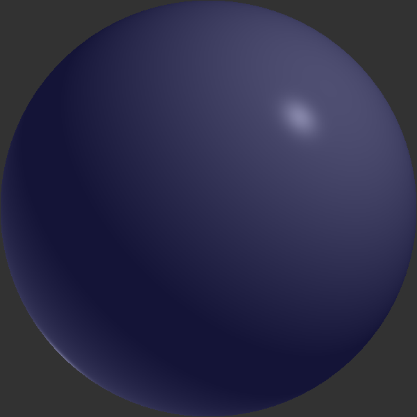
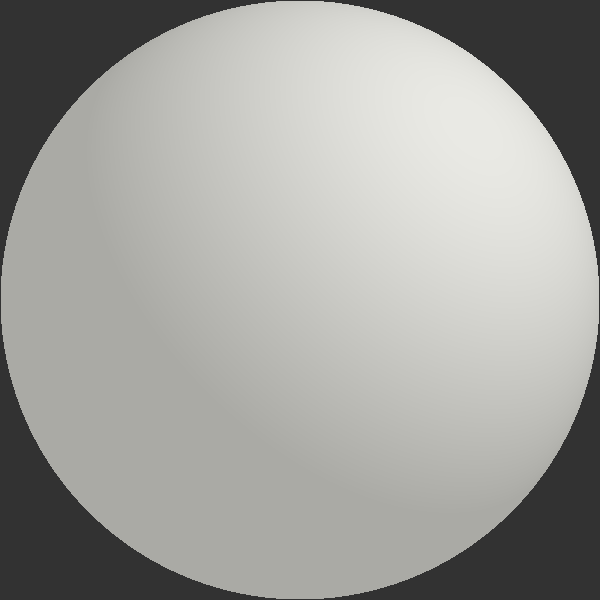
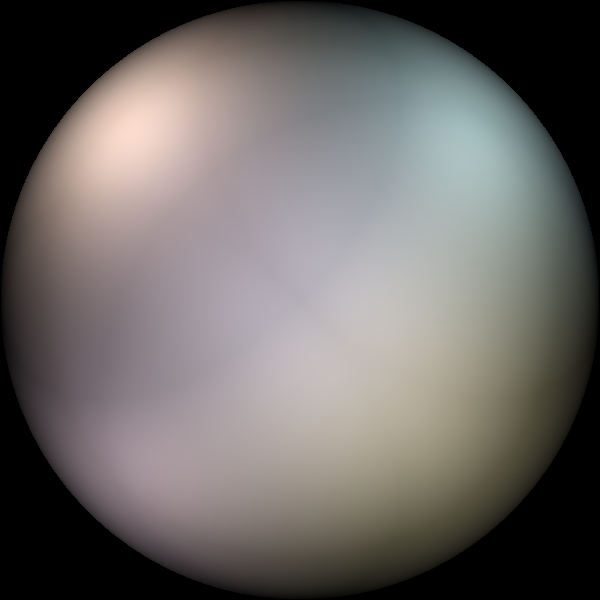

# Phong shading simulation

University assignment from Computer Graphics.

## Building

### Requirements

`sudo pacman -S sfml clang make`

### Build

`make`

## Usage

### Run

`./build/main input/<config>`

Replace `<config>` with file name of .ini file from `input` directory.

### Test

`./build/test`

## Obtained images 

